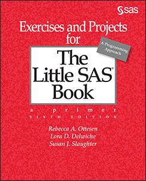

# Exercises and Projects for The Little SAS Book, Sixth Edition
By Rebecca A. Ottesen, Lora D. Delwiche, and Susan J. Slaughter

This repository contains the sample code for the book <i>Exercises and Projects for The Little SAS Book, Sixth Edition.</i>
 
Data files are SAS data sets. 

## Description
Hone your SAS skills with Exercises and Projects for The Little SAS Book, Sixth Edition!

Now in its sixth edition, the best-selling The Little SAS Book just keeps getting better. Readers worldwide study this easy-to-follow book to help them learn the basics of SAS programming. Rebecca Ottesen has once again teamed up with the authors of The Little SAS Book, Lora Delwiche and Susan Slaughter, to provide a way to challenge and improve your SAS skills through thought-provoking questions, exercises, and projects. Each chapter has been updated to match The Little SAS Book, Sixth Edition. The book contains a mixture of multiple-choice questions, open-ended discussion topics, and programming exercises with selected answers and hints. It also includes comprehensive programming projects that are designed to encourage self-study and to test the skills developed by The Little SAS Book.

Exercises and Projects for The Little SAS Book, Sixth Edition is a hands-on workbook that is designed to improve your SAS skills whether you are a student or a professional.

## Details

*Epub* ISBN: 978-1-64295-525-5 
*Kindle* ISBN: 978-1-64295-526-2  
*PDF* ISBN: 978-1-64295-524-8  
*Paperback* ISBN: 978-1-64295-284-1  
*Hardback* ISBN: 978-1-64295-617-7

<a href="https://www.sas.com/storefront/aux/en/splsbex/73046_excerpt.pdf">Table of Contents and Excerpt</a>

About the Authors 
<a href="https://support.sas.com/en/books/authors/rebecca-ottesen.html">Rebecca A. Ottesen</a> 
<a href="https://support.sas.com/en/books/authors/lora-delwiche.html">Lora D. Delwiche</a> 
<a href="https://support.sas.com/en/books/authors/susan-slaughter.html">Susan J. Slaughter</a>

  

## License

This project is licensed under the [Apache 2.0 License](./LICENSE).
